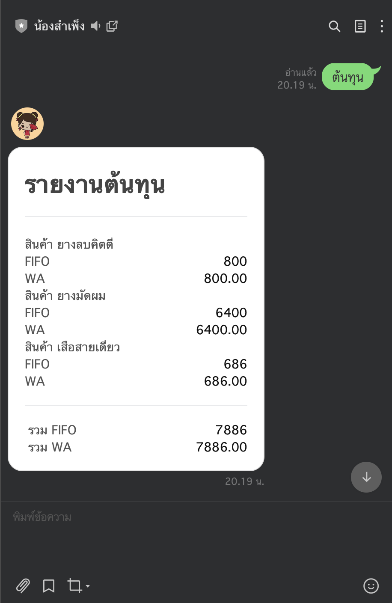

# LINE Messaging using Dialogflow

A LINE chatbot with Dialogflow to retrieve the data from the Google sheet, calculate the cost and visually report the user with a flex message in the chat

## Example Usage

- Google Sheet Mock Data

 

- LINE Sampeng Messaging

## Reference

- [Dialogflow x LINE](https://medium.com/linedevth/line-x-dialogflow-%E0%B8%AA%E0%B8%A3%E0%B9%89%E0%B8%B2%E0%B8%87-chatbot-line-%E0%B9%81%E0%B8%9A%E0%B8%9A%E0%B8%87%E0%B9%88%E0%B8%B2%E0%B8%A2%E0%B9%86-%E0%B8%94%E0%B9%89%E0%B8%A7%E0%B8%A2-dialogflow-%E0%B9%81%E0%B8%A5%E0%B8%B0-line-bot-designer-%E0%B8%81%E0%B8%B1%E0%B8%99%E0%B9%80%E0%B8%96%E0%B8%AD%E0%B8%B0-572476c2eacd)
- [Integrate LINE with Dialogflow](https://medium.com/linedevth/%E0%B9%80%E0%B8%A3%E0%B8%B5%E0%B8%A2%E0%B8%99%E0%B8%A3%E0%B8%B9%E0%B9%89%E0%B8%81%E0%B8%B2%E0%B8%A3-integrate-line-bot-%E0%B9%80%E0%B8%82%E0%B9%89%E0%B8%B2%E0%B8%81%E0%B8%B1%E0%B8%9A-dialogflow-%E0%B9%81%E0%B8%A5%E0%B8%B0-firebase-%E0%B8%9C%E0%B9%88%E0%B8%B2%E0%B8%99-bmi-bot-5a30a672f6ae)
- [Sending Line Flex Message from DialogFlow Chatbot](https://sennalabs.com/en/blogs/sending-line-flex-message-from-dialogflow-chatbot)
